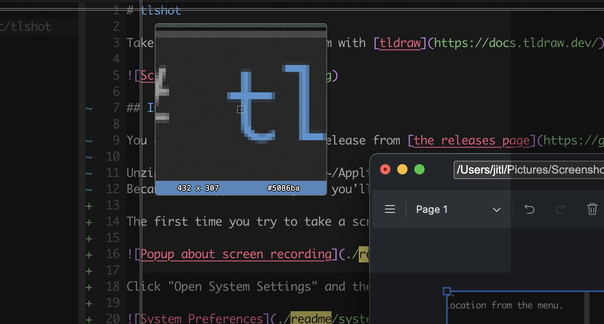
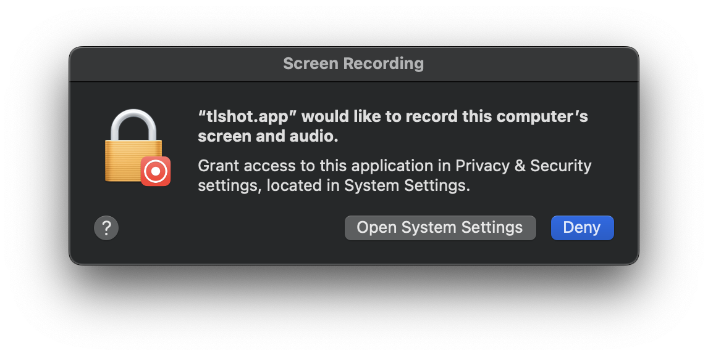
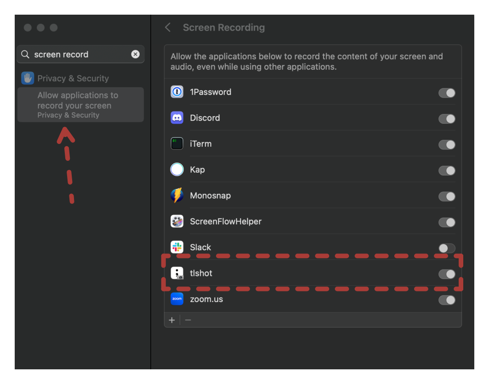
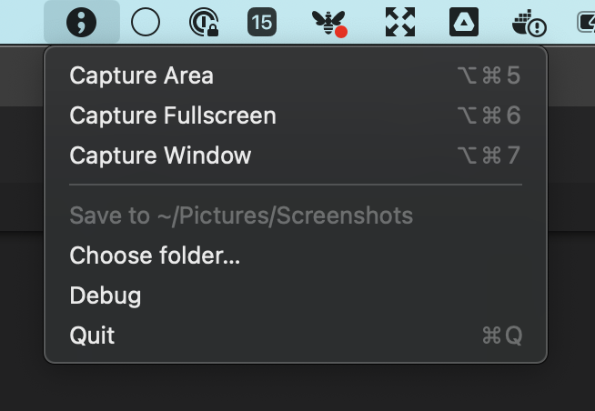
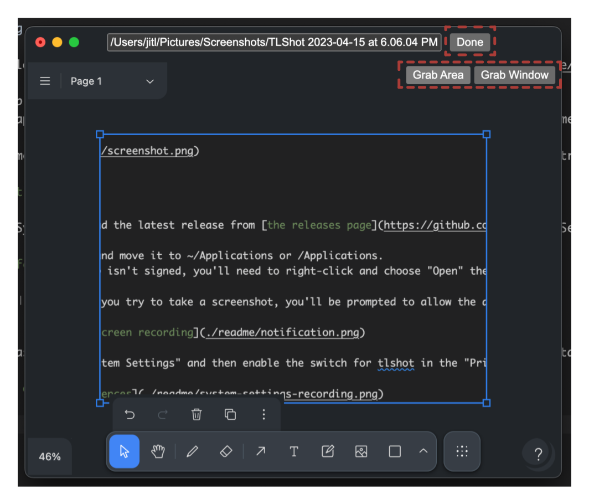

# tlshot

Take screenshots and edit them with [tldraw](https://docs.tldraw.dev/).

## Installing

You can download the latest release from [the releases page](https://github.com/justjake/tlshot/releases).

Unzip the app and move it to ~/Applications or /Applications.
Because the app isn't signed, you'll need to right-click and choose "Open" the first time you run it.

The first time you try to take a screenshot, you'll be prompted to allow the app to control your computer:

Click "Open System Settings" and then enable the switch for tlshot in the "Privacy and Security" section:

## Usage

tlshot runs as a menu bar app. Click on its icon or use one of the global shortcuts to capture a screenshot.

An editor will open to mark up the screenshot.

- Capture more screenshots using the "Grab Area" or "Grab Window" buttons.
- Edit the path to change the file location. You can change the default location from the menu.
- Click "done" to save and close the editor.
- Closing the window otherwise discards the screenshot.

